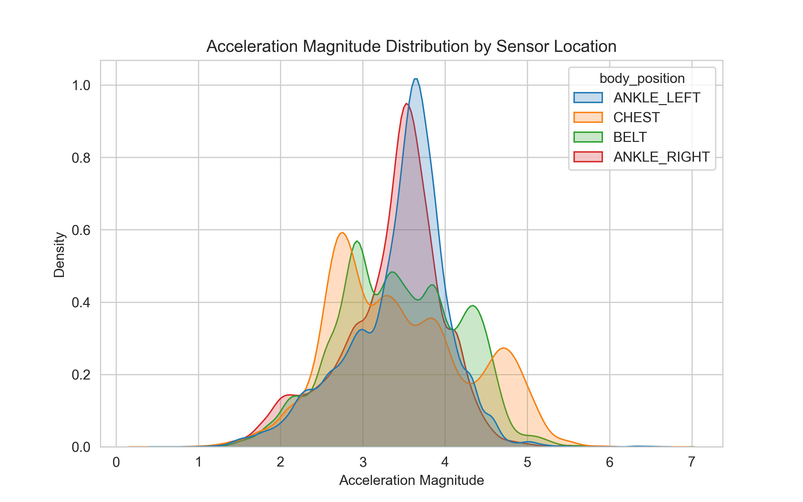
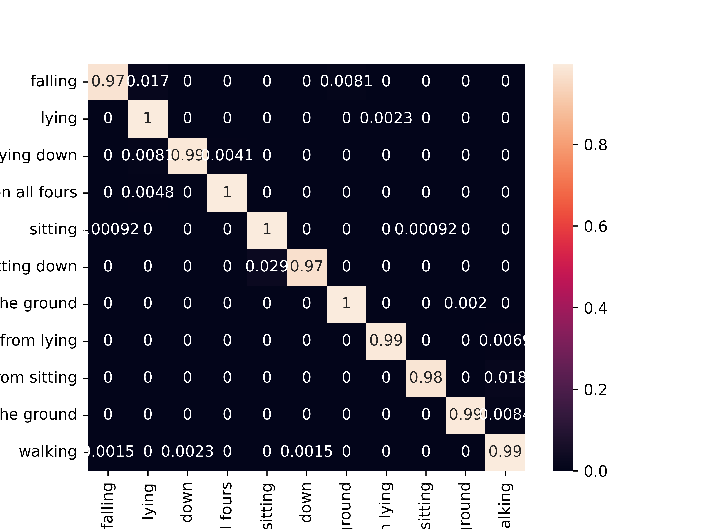
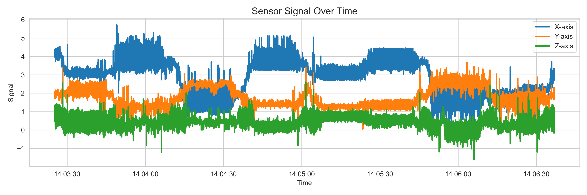
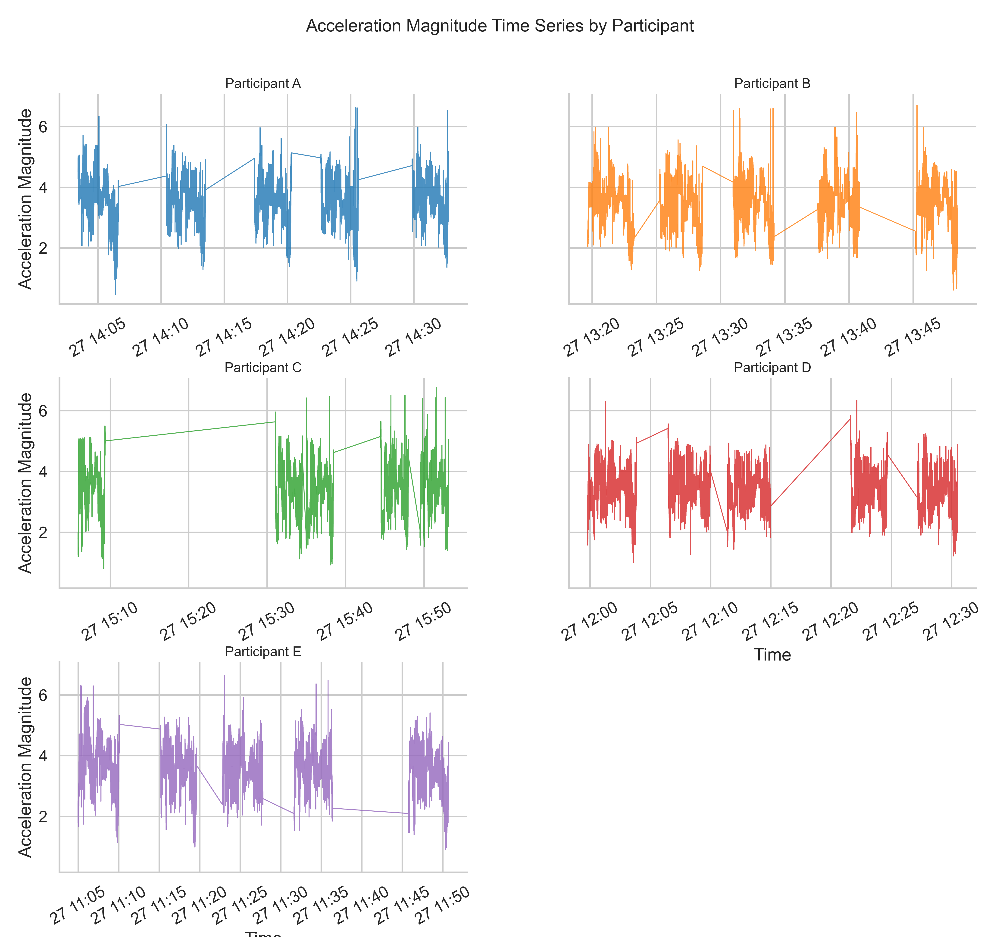
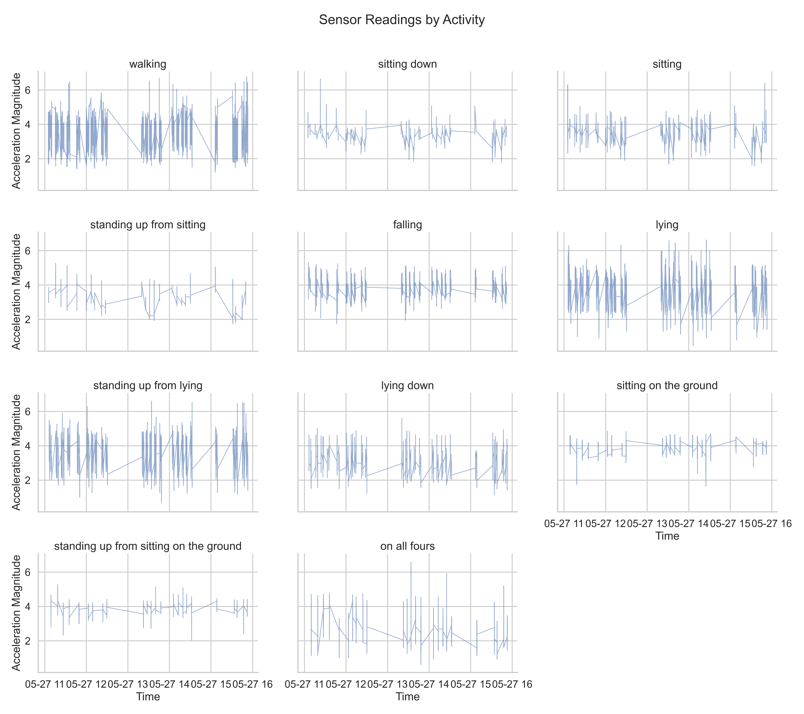

# Smart Home Fall Detection for Elderly Safety (Data-Driven Simulation)


## Overview 

Falls are a leading cause of injury among elderly individuals living independently.  

This project implements a **data-driven fall detection system** using motion sensor data collected from a smart home environment.  

Instead of relying on a single classification model, the system compares multiple sequence modeling approaches:

| Model | Type | Purpose |
|-------|------|---------|
| **LSTM (Long Short-Term Memory)** | Deep learning sequence model(Baseline) | Sequence-aware fall detection |
| **Hidden Markov Model (HMM)** | Generative probabilistic | General activity modeling |
| **Random Forest + HMM Smoother** | Ensemble | Frame-level classification + temporal smoothing |
| **Hidden Semi-Markov Model (HSMM)** | Probabilistic with duration prior | Safety-critical fall detection |

The frontend provides an **interactive Streamlit dashboard** that performs sliding-window fall detection, visualizing fall probability over time.

---

## About the Dataset

### Context
This dataset originates from research on safer smart environments for independent living. It was collected to analyze human activity using **body-worn sensors**, with a focus on understanding movements and detecting falls in a controlled setting.

### Dataset Overview
- **Participants:** 5 individuals  
- **Repetitions:** Each participant performed the same scenario **five times**  
- **Sensors:** Four body-worn tags per participant:
  - `ANKLE_LEFT` → 010-000-024-033  
  - `ANKLE_RIGHT` → 010-000-030-096  
  - `CHEST` → 020-000-033-111  
  - `BELT` → 020-000-032-221  
- **Measurements:** 3D localization coordinates (`X`, `Y`, `Z`) for each sensor  
- **Activities:** walking, falling, lying down, sitting down, standing up, on all fours, and others (11 total)  
- **Instances:** 164,860  
- **Features:** 8 (sequence name, tag ID, timestamp, date, X, Y, Z, activity label)  
- **Missing values:** None  

### Data Structure
- Each row corresponds to a **single sensor reading** at a specific timestamp.  
- Sequence name identifies the participant and repetition: e.g., `A01` → Participant A, first scenario repetition.  
- Tag ID identifies the sensor.  
- `Activity` column is categorical with 11 possible activities.

### Variable Summary

| Column        | Description |
|---------------|-------------|
| Sequence Name | Participant & repetition (A01–E05) |
| Tag ID        | Sensor identifier (ANKLE_LEFT, ANKLE_RIGHT, CHEST, BELT) |
| Timestamp     | Unique numeric timestamp |
| Date          | Format: `dd.MM.yyyy HH:mm:ss:SSS` |
| X             | X-coordinate of the tag |
| Y             | Y-coordinate of the tag |
| Z             | Z-coordinate of the tag |
| Activity      | Human activity label (walking, falling, lying, etc.) |


### Acknowledgements
Refactored from the [UCI Localization Data for Person Activity dataset](https://archive.ics.uci.edu/ml/datasets/Localization+Data+for+Person+Activity).  
> B. Kaluza, V. Mirchevska, E. Dovgan, M. Lustrek, M. Gams, *An Agent-based Approach to Care in Independent Living*, International Joint Conference on Ambient Intelligence (AmI-10), Malaga, Spain, In press.

---

## Project Structure
```
project_root/
│
├── data/
│   └── ConfLongDemo_JSI.txt
│
├── model/
│   ├── __init__.py
│   ├── preprocessing.py
│   ├── inference.py
│   │
│   ├── hmm/
│   │   ├── __init__.py
│   │   └── train.py
│   │
│   ├── lstm/
│   │   ├── __init__.py
│   │   ├── model.py
│   │   └── train.py
│   ├── rf/
│   │   ├── __init__.py
│   │   └── train.py
├── app.py
├── requirements.txt
└── README.md
```

---
## Exploratory Data Analysis 
### Acceleration Magnitude Distribution

Acceleration magnitude summarizes the overall motion intensity captured by the wearable sensors. The chart below shows the distribution helps identify differences in movement patterns across sensor locations.

<p align="center">
  
</p>

Key observations:

- The ankle readings have higher acceleration magnitudes, corresponding to more dynamic movements.
- The chest and belt sensors show lower values, which are associated with stationary or low-motion activities.

---

### Activity Transition Patterns

To understand how activities evolve over time, we computed transition probabilities between activities using a normalized transition matrix.

<p align="center">
  
</p>

Key observations:

- Certain activities exhibit strong self-transitions, such as lying and sitting, indicating temporal persistence.
- These patterns motivate the use of **sequence models such as Hidden Markov Models (HMMs)**.

---

### Sensor Signal Over Time

The following chart shows raw accelerometer signals along the X, Y, and Z axes for a single sequence A01. 

<p align="center">
  
</p>

Key observations:
- Smooth signal segments indicate periods of stable activity, while sudden spikes may correspond to abrupt movements. The signal trend shifting show potential activites changes

---
### Accelation Time Series by Participants

The following chart shows the raw accelerometer signals recorded from participants **A–E** across their repeated activity sessions.

<p align="center">
  
</p>

Key observations:
- Each participant performs the same scenario **five times**, but the sensor patterns vary across repetitions.
- Because the signal patterns differ between repetitions, it may be more appropriate to **treat each repetition as an independent sequence** during modeling.


---
### Sensor Reading by Activities

The following chart shows raw accelerometer signals across different **activities**.

<p align="center">
  
</p>

Key observations:
- Some activities produce **very similar sensor patterns**, such as *sitting down*, *sitting*, and *sitting on the ground*.
- These activities may potentially be **grouped into broader activity categories** during modeling or preprocessing.


---
## Data Preprocessing

**General Preprocessing Steps For All Models:**

- Load dataset and assign descriptive column names  
- Convert `date_time` to pandas datetime and acceleration columns to float  
- Sort by `sequence_name` and `date_time` for chronological order  
- Check for missing values and verify data integrity  
- Map activity labels for binary or multi-class tasks  
- Apply **StandardScaler** for feature normalization  
- One-Hot encode categorical features (e.g., sensor ID)  
- Group by `sequence_name` for participant-level analysis  
- Compute derived features like **acceleration magnitude**

**Distinctive Preprocessing:**
- **Random Forest / HMM:** Sliding windows → statistical features per window (mean, std, min, max, skew, kurtosis)  
- **HMM / HSMM:** Sequence-level multivariate observations, optionally augmented with duration features for HSMM  

---


---

## Backend Models

### 1. LSTM (Baseline)
- Bidirectional sequence model for 12-dimensional motion features  
- Binary classification: falling vs non-fall (frame-level)  
- Sigmoid probability output with optimized decision threshold  
- Trained with **class-weighted Binary Cross-Entropy** to address severe fall/non-fall imbalance  

### 2. 12D HMM
- One Gaussian HMM trained per activity class  
- Uses **full covariance matrices** to capture correlations across sensor axes  
- Predicts activity via **log-likelihood comparison** and **softmax normalization**  
- Works on **frame-level sequences** derived from sensor data  

### 3. Random Forest + HMM Smoother
- Stage 1: RF predicts frame-level activity probabilities from sensor features  
- Stage 2: HMM smooths RF predictions using the **Viterbi algorithm**  
- Combines nonlinear frame-level classification with **temporal coherence**  

### 4. Hidden Semi-Markov Model (HSMM) – Not in Dashboard
- Models **explicit segment durations** per activity using Poisson distributions  
- Uses **segment-level Viterbi decoding**  
- Prioritizes **high recall on fall events**, sacrificing overall accuracy for safety


---
## Model Results

### 1. Baseline LSTM (Weighted)   
| Class         | Precision | Recall | F1-score | Support  |
|---------------|:---------:|:-----:|:--------:|---------:|
| Non-fall (0)  | 1.00      | 0.99  | 0.99     | 161,887  |
| Fall (1)      | 0.63      | 0.73  | 0.68     | 2,973    |
| **Overall**   | -         | -     | 0.99     | 164,860  |

  - Achieved **high overall accuracy (0.987)** and **macro F1 score (0.84)**

  - **Class imbalance was explicitly addressed** using **class-weighted Binary Cross-Entropy loss**, giving higher penalty to missed fall events during training.

  - The model achieved **fall detection performance of F1 = 0.68** with **recall = 0.73**, indicating it is able to capture many true fall events.

  - However, the model is **highly biased toward the dominant non-fall class** because fall frames represent only a **very small fraction of the dataset**.

  - As a result, the **extremely high overall accuracy is misleading**, and the model may **struggle to generalize to new subjects or real-world environments** where fall patterns and class distributions differ.

--- 
### 2. Activity-Level 12D HMM Model

| Class                               | Precision | Recall | F1-score | Support |
|------------------------------------|:---------:|:-----:|:--------:|--------:|
| Falling                             | 0.10      | 0.39  | 0.16     | 2,973   |
| Lying                               | 0.67      | 0.69  | 0.68     | 54,480  |
| Lying down                          | 0.14      | 0.49  | 0.22     | 6,168   |
| On all fours                        | 0.18      | 0.45  | 0.26     | 5,210   |
| Sitting                             | 0.90      | 0.57  | 0.70     | 27,244  |
| Sitting down                        | 0.00      | 0.00  | 0.00     | 1,706   |
| Sitting on the ground               | 0.78      | 0.70  | 0.73     | 11,779  |
| Standing up from lying               | 0.15      | 0.10  | 0.12     | 18,361  |
| Standing up from sitting             | 0.12      | 0.03  | 0.05     | 1,381   |
| Standing up from sitting on ground  | 0.39      | 0.41  | 0.40     | 2,848   |
| Walking                             | 0.97      | 0.58  | 0.72     | 32,710  |
| **Overall**                          | -         | -     | 0.37     | 164,860 |

  - **Frame-level accuracy:** 0.54; **Macro F1:** 0.37  
  - Reliable classification for **walking, sitting, and lying**, but **falling is poorly detected**.  
  - Model is affected by **class imbalance** and limited temporal modeling, limiting generalization to rare events.  


---


### 3. Random Forest (RF) + HMM Smoother

  
  

- Achieved the **highest overall accuracy (0.85)** and **macro F1 score (0.74)** across all tested models, outperforming the best previous pure HMM (**12D model: 0.72 accuracy**) by a meaningful margin.

- The **HMM smoothing layer improved accuracy by +0.02** over the Random Forest alone (**0.828 → 0.847**) by penalizing physically implausible frame-to-frame transitions.

- These results confirm that **temporal context adds value** on top of frame-level classification.

- **Walking** and **sitting** are classified with high reliability (**F1 = 0.93** and **0.92**, respectively), reflecting their distinctive and consistent sensor signatures across subjects.

- **Falling remains the weakest class** (**F1 = 0.48**, **recall = 0.33**), meaning the model misses roughly **two-thirds of actual fall events** at the frame level. This represents a critical limitation for a fall detection system, where **false negatives carry a high safety cost**.

- The **precision–recall imbalance for falling** (**precision = 0.86**, **recall = 0.33**) suggests the model is **conservative**: when it predicts a fall it is usually correct, but it fails to flag the majority of actual falls. This is likely because falls occupy **very few frames relative to the total dataset**.
  
---

### 4. Hidden Semi-Markov Model


  - Despite a **low overall accuracy (0.44)**, the HSMM achieved the **highest falling recall (0.93)** and **falling F1 score (0.78)** across all tested models — outperforming the **RF + HMM smoother** on the most **safety-critical class** by a substantial margin.

  - This strength is directly attributable to the **duration prior**: the model penalizes assigning **“falling” to long, stable segments**, concentrating fall predictions on **brief high-jerk segments** where true falls occur.

  - The model performs poorly on other classes, such as **lying (F1 = 0.00)** and **sitting (F1 = 0.00)**, indicating that the **duration distributions for static activities overlap heavily**. As a result, the HSMM tends to **misclassify these activities consistently** — a known failure mode when **activity durations vary across subjects**.

---

## Summary 


| Model           | Overall Accuracy | Falling Recall | Falling F1 | Notes |
|-----------------|----------------|----------------|------------|-------|
| LSTM (Weighted) | 0.99           | 0.73           | 0.68       | Binary model; highest overall accuracy but biased on falling due to severe class imbalance |
| 12D HMM         | 0.72           | 0.40           | 0.35       | Baseline HMM using all 12 sensor features; moderate overall performance |
| RF + HMM (fall)        | 0.86           | 0.33           | 0.48       | Frame-level RF predictions smoothed by HMM; high multi-class accuracy |
| HSMM (fall)            | 0.68           | 0.40           | 0.50       | Temporal model focused on fall events; moderate fall detection, lower overall accuracy

- **LSTM (Weighted)** achieves **very high overall accuracy (0.99)**, but this is largely driven by the **dominant non-fall class**. While it captures many fall events (**recall 0.73, F1 0.68**), the model is **less reliable for unseen subjects or real-world falls**.

- **12D HMM** serves as a simple baseline using all 12 sensor features. It achieves **moderate overall performance (0.72)** but has **limited fall detection capability (recall 0.40, F1 0.35)**, reflecting the challenges of modeling rare events without explicit fall-focused mechanisms.

- **RF + HMM (fall)** combines frame-level Random Forest predictions with HMM smoothing. This approach provides **the best multi-class accuracy (0.86)** and **temporal consistency**, though its fall detection performance remains modest (**recall 0.33, F1 0.48**).

- **HSMM (fall)** achieves **low overall accuracy (0.68)** and **moderate fall detection (recall 0.40, F1 0.50)**. While it incorporates **explicit temporal modeling to capture fall events**, its performance is **limited compared to other models**, reflecting the trade-off between fall sensitivity and overall accuracy.

### Potential Implementation

**Option 1:** Use **LSTM (Weighted)** as a **initial fall alert**, while leveraging **RF + HMM Smoother** for general activity state **modification**.

**Option 2:** Combine predictions from multiple models to create a **more robust fall alert**, potentially with **custom logic**, though this may increase computational complexity.


---

## Limitation and Future Improvement

- **Enhanced sensors:** Add gyroscopes, pressure sensors, or ambient devices for richer motion data.  
- **Class imbalance & bias:** LSTM favors non-fall frames; use data augmentation or class-weighted losses to improve fall recall.  
- **Generalization & validation:** Test on larger, diverse datasets for robust real-world performance.  
- **Interpretability:** Add explainability (e.g., SHAP, attention) to increase trust in predictions.  
- **Multi-model approach:** Combine HSMM (high fall recall) and RF+HMM (multi-class accuracy) for a robust fall alert system.

---


## Running the Application

**1. Install dependencies:**

```bash
pip install -r requirements.txt
```
**2. Train models (only if not already trained):**

- Train hmm model
```bash
python -m models.hmm.train
```

- Train lstm model - This might take a long time
```bash
python -m models.lstm.train
```

- Train RF+HMM model
```bash
python -m models.rf.train
```

**3. Run the Streamlit app**

```bash
streamlit run app.py
```

---
### Interact with the Fall Detection Dashboard

The dashboard provides an interactive interface for exploring participant sensor sequences and visualizing fall detection results.

**Features:**

- **Select participant sequences:**  
  Choose from sequences containing falls to analyze specific events.

- **Run sliding window detection:**  
  Execute LSTM, Random Forest, and HMM models on fixed-size sliding windows of sensor data.

**Visualizations:**

- **Sensor readings over time:**  
  View all accelerometer and gyroscope signals. Ground truth fall periods are marked with **red vertical lines**:  
  - Solid line → Fall start  
  - Dashed line → Fall end

- **LSTM & Random Forest fall probability:**  
  Window-level probabilities plotted as line charts. High-risk windows (predicted as falling) are highlighted in tables.

- **HMM activity predictions:**  
  Model-predicted activity classes over time are displayed as line plots.

- **Combined fall alerts:**  
  Identify windows where **any model predicts a fall**, summarized in a table for quick review.

The interface allows users to explore **ground truth vs. model predictions** interactively, making it easier to validate and analyze fall detection performance.


<p align="center">
  
</p>

---